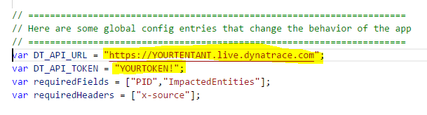
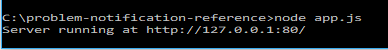
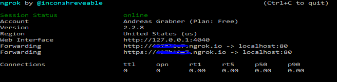
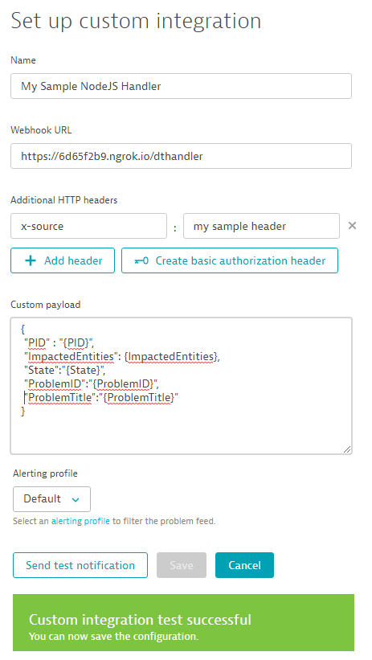
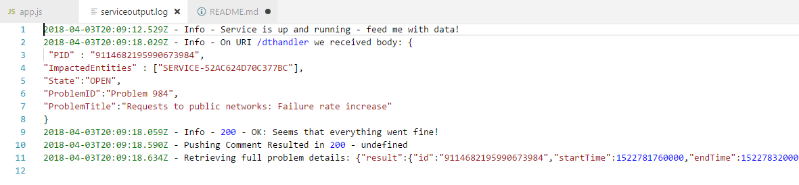
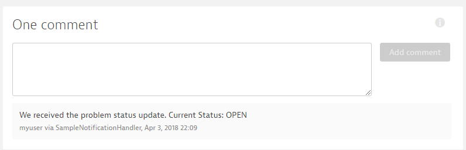

# Dynatrace Problem Notification Reference Implementations
This repo provides reference implementations for custom Dynatrace Problem Notifications. While Dynatrace provides a set of out-of-the-box integrations with tools such as ServiceNow, xMatters, VictorOps, PagerDuty, Slack, HipChat, JIRA and others ... there is also an option to implement your own custom problem notification integration

This GitHub repo should be a good starting point in case you want to build your own custom problem notification integration.
The first sample we provide is written in Node.js and it implements several best practices
1. Validate Input Headers
2. Validate Input Values
3. Correctly Handle Test Notification Messages
4. Pull all Problem Details through Dynatrace REST API
5. Push a Comment back to Dynatrace

To run this sample and connect it with Dynatrace

**Pre-Requisits**
1. Sign-up for a [Dynatrace SaaS Free Trial](http://bit.ly/dtsaastrial)
2. You need to have node.js runtime and a tool such as [ngrok](https://ngrok.com/) to expose your local node.js app via a public IP. Alternatively you can obviously run the app on a public accessible web server

**Lets GO:**
Here are the steps to run this service and connect it with your Dynatrace instance

1. Edit app.js and specify your Dynatrace Tenant URL and API Token.

2. Now lets run the app: node app.js

3. Now lets expose that local port to the world: ngrok http 80

4. In Dynatrace go to Settings -> Integration -> Problem Notification -> Set up notification -> Custom Integration and configure as shown below using your IP from ngrok

5. Everytime you click on Send test notification and pass some invalid parameters or everytime Dynatrace actually sends information to your node.js app you will see log entries in serviceoutput.log. Here are some outputs from my local trial:

6. If Dynatrace passes a real problem ID to your handler then the handler will also post a comment back to the problem ticket

ENJOY and let me know how this helps!